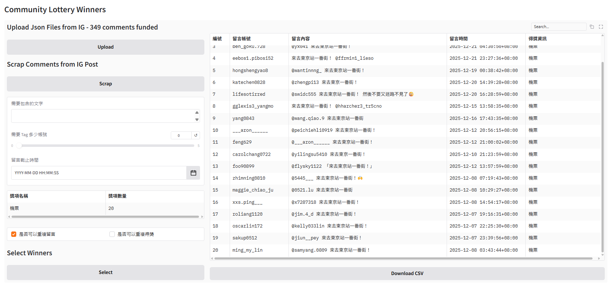

# Community Lottery Winners



An automated tool designed for Instagram giveaway campaigns. It automatically scrapes post comments, filters participants based on specific criteria, and randomly selects winners.

## Features

- 🔍 **Automatic Comment Scraping**: Automatically scrapes all comments from Instagram posts
- 🎯 **Flexible Filtering Criteria**:
  - Required text that must be included
  - Required number of tagged accounts
  - Comment deadline time limit
  - Allow duplicate comments option
- 🎁 **Multiple Prizes Support**: Configure multiple prize types and their quantities
- 🎲 **Fair Lottery**: Support for allowing duplicate winners option
- 📊 **Data Visualization**: Display all comments and winner information in a table format
- 📥 **CSV Export**: Export results as CSV files for further processing

## Requirements

- Python 3.12 or higher
- Chrome browser (for installing the extension)

## Installation

### 1. Install Python Dependencies

This project uses `pyproject.toml` for dependency management. Install dependencies using `uv`:

```bash
uv sync
```

Or if you prefer using pip with the project configuration:

```bash
pip install -e .
```

### 2. Install Chrome Extension

1. Open Chrome browser
2. Navigate to `chrome://extensions/`
3. Enable "Developer mode" (toggle in the top right)
4. Click "Load unpacked"
5. Select the `chrome-extensions` folder in this project
6. Verify the extension is successfully installed

## Usage

### Step 1: Get Instagram Post Information

1. Open an Instagram post page in Chrome browser
2. You will see a "Download Comments" button appear below the post (next to the share button)
3. Click the button, and the system will automatically download a JSON file (format: `instagram_{shortcode}_headers.json`)
4. This file contains the authentication information and post identifier needed to scrape comments

### Step 2: Launch the Application

```bash
python main.py
```

The application will automatically open in your browser (default: `http://127.0.0.1:7860`)

### Step 3: Upload JSON File

1. In the application interface, click the "Upload" button
2. Select the JSON file downloaded in Step 1
3. After successful upload, the total number of comments for that post will be displayed, and the "Scrap" button will be enabled

### Step 4: Scrape Comments

1. Click the "Scrap" button to start scraping comments
2. The system will display a progress bar showing the current number of comments being processed
3. After scraping is complete, all comment data will be displayed in the table on the right

### Step 5: Configure Lottery Conditions

Set the following conditions in the left panel:

- **Required Text**: Specific text that must be included in comments (optional)
- **Required Number of Tagged Accounts**: Number of accounts that must be tagged in comments (0-5)
- **Comment Deadline Time**: Only consider comments before this time (optional)
- **Prize Configuration**: Set prize names and quantities in the table
  - Example: Prize name "Flight Ticket", Prize quantity "20"
- **Allow Duplicate Comments**: Check to allow the same account to comment multiple times
- **Allow Duplicate Winners**: Check to allow the same account to win multiple prizes

### Step 6: Select Winners

1. After confirming all conditions are set, click the "Select" button
2. The system will filter comments based on the set conditions and randomly select winners
3. Winner information will be displayed in the "Prize Information" column of the table

### Step 7: Export Results

1. Click the "Download CSV" button
2. The system will download a CSV file containing all comments and winner information
3. File name format: `instagram_{shortcode}_{date}.csv`

## Project Structure

```
Community-Lottery-Winners/
├── main.py                    # Main application (Gradio UI)
├── pyproject.toml             # Python project configuration
├── chrome-extensions/         # Chrome extension
│   ├── manifest.json          # Extension configuration file
│   ├── content.js             # Content script entry point
│   ├── modules/
│   │   ├── background.js      # Background service (captures request headers)
│   │   └── download-button.js # Download button functionality
│   └── utils/
│       └── dom-utils.js       # DOM manipulation utilities
└── README.md                  # This file
```

## Technical Architecture

### Backend
- **Gradio**: For building the Web UI
- **Pandas**: Data processing and analysis
- **Requests**: HTTP requests (scraping Instagram API)
- **Python 3.12+**: Main development language

### Chrome Extension
- **Manifest V3**: Uses the latest extension standard
- **Content Scripts**: Injects download button into Instagram pages
- **Background Service Worker**: Monitors and captures Instagram GraphQL request headers

## Important Notes

1. **Instagram API Limitations**: This tool uses Instagram's public GraphQL API. Please note:
   - You may need to be logged into an Instagram account for it to work properly
   - Too frequent requests may be rate-limited by Instagram
   - The tool has built-in random delay mechanisms to avoid triggering limits

2. **Privacy and Security**:
   - JSON files contain your Instagram authentication information (Cookies, CSRF Tokens, etc.)
   - Please keep these files secure and do not share them with others
   - It is recommended to delete JSON files after use

3. **Data Accuracy**:
   - The system will scrape all visible comments
   - If a post has many comments, the scraping process may take some time
   - It is recommended to use in a stable network environment

## License

Please refer to the [LICENSE](LICENSE) file for detailed license information.

## Disclaimer

This tool is for educational and research purposes only. Please comply with Instagram's Terms of Service and relevant laws and regulations when using it. The developers are not responsible for any consequences resulting from the use of this tool.
